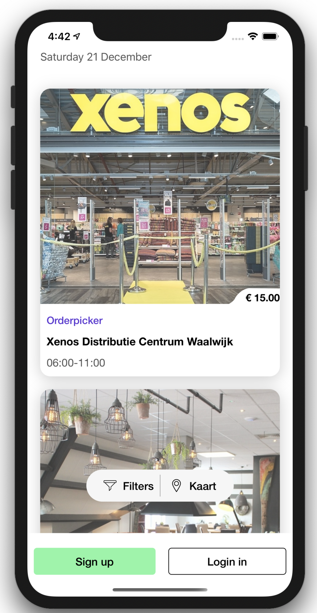
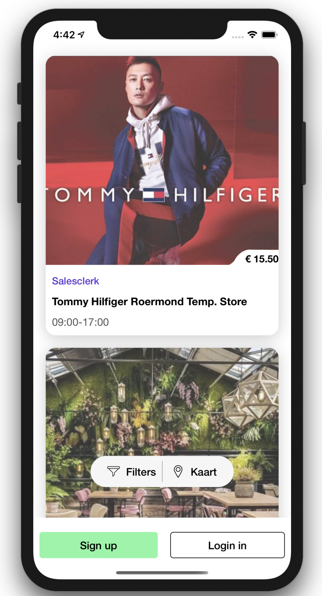
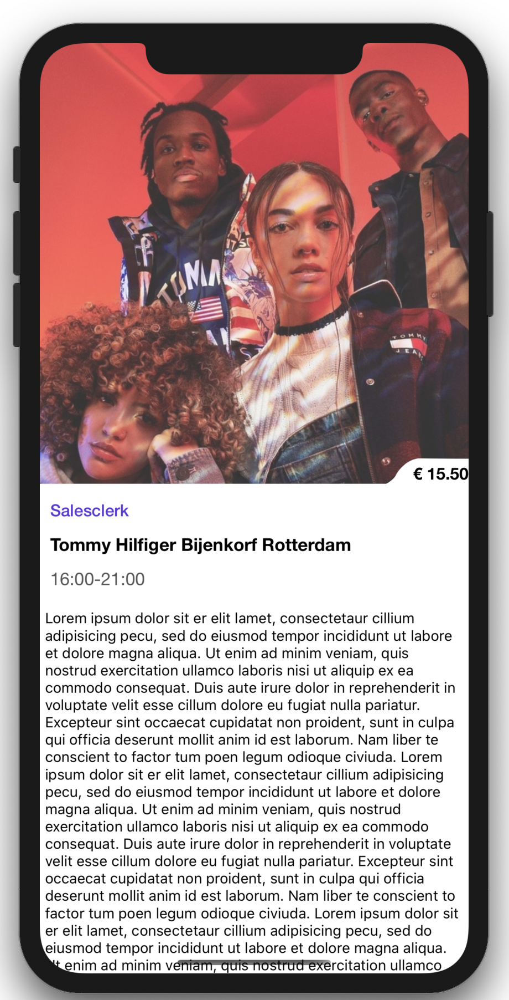
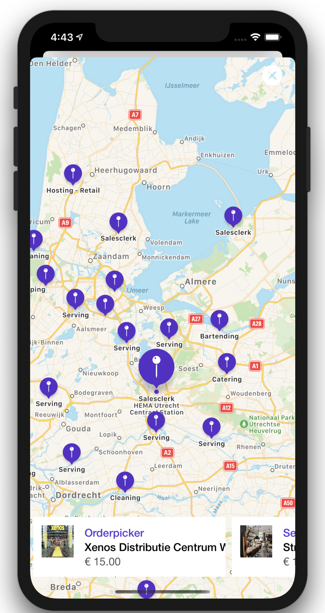

# Temper
========================

[](https://developer.apple.com/iphone/index.action)
[](https://developer.apple.com/swift)
[](http://mit-license.org)

## Overview
iOS Temper client that display freelancer jobs sectioned by date. Developed using Swift, VIPER and TDD.






## App Description

Using this application, a user should be able to see all the available jobs. The data is available by connecting to the Temper API.

**App use cases**

*Job list*:

- In this screen, the app shows a collection view that contains a list of jobs. the collection view is inspired by iOS App Store app like a list of cards and showing a card details with a transition. This list suppors pull to refresh and pagination to load data infinitely while scrolling in the collection view.

*Details*:

- When tapping an item from job list screen, user should be able to see deetails screen that has some informations about the selected job. it has a beautiful transition built with `Card Transition` component you can find in the list of components in the project. 

*Map*:

- In this screen, the app shows a map with jobs aroud a user's current location. this screen has a handy collection view that contain all the jobs, each item in the collection view has a job category name, client name, hourly rate of the job. if a user swipe the collection view horizontally the app will select the specific annotation for the job on the map and it works the other way around, if a user select a job annotation form the map the collection view will scroll to that specific job. 

*Sign up*:

- When tapping either login or sign up the app shows a modally presented view controller that enables the user to sign up or login. 

**Features**
* UI: the app is heavily inspired by iOS App Store app. 
* Request retrier: if a request fail due to server error the app will retry that request again for 3 times each 1 second. Thanks to Alamofire's RequestRetrier, please check NetworkRequestRetrier. 

* In App Notification: if the device was offline and the app faild to make a request it will show in-app message to warn the user that there is not internet connection.

* Pagination: infintly load new jobs while scrolling at the end of the collection view.

* Pull to refresh


**Improvements**
* Increase unit test code coverage
* Could use reactive programming like `RxSwift` instead of delegation 
* optimize map screen to work more somthly with LOTS OF annotations.

## Installation

Just clone the repo or download it in zip-file, Open the project in Xcode then test it on your iOS device or iOS simulator.


# Xcode Project files structure
```bash
.swift
+-- Common
|   +-- Extensions
    |   +-- UINavigationController+NavigationControllable.swift
|   +-- Components
    |   +-- Card Transition
+-- Storyboards
|   +-- Jobs.storyboard
|   +-- LaunchScreen.storyboard
+-- Models
|   +-- Job.swift
|   +-- Client.swift
+-- Assets
|   +-- Assets.xcassets
+-- Base
|   +-- Network
+-- Modules
|   +-- Jobs
    |   +-- Interactor
        |   +-- JobsInteractable.swift
        |   +-- JobsInteractor.swift
    |   +-- Presenter
            |   +-- JobsPresentable.swift
            |   +-- JobsPresenter.swift
    |   +-- Router
            |   +-- JobsRouter.swift
    |   +-- View
            |   +-- JobsViewable.swift
            |   +-- JobsViewController.swift
|   +-- Map
|   +-- Signup 
         
.swift tests
+-- Fixtures
+-- Mocks
+-- Modules
|   +-- Jobs
    |   +-- JobsInteractorTests.swift
    |   +-- JobsPresenterTests.swift
    |   +-- JobsServiceTests.swift    
|   +-- Map
    |   +-- MapInteractorTests.swift
    |   +-- MapPresenterTests.swift
|   +-- Signup
    |   +-- SignUpPresenterTests.swift
```


# Design Patterns used:

# VIPER Architecture design pattern:

**What is VIPER?**
VIPER is an application of Clean Architecture to iOS apps. The word VIPER is a backronym for View, Interactor, Presenter, Entity, and Routing. Clean Architecture divides an app’s logical structure into distinct layers of responsibility. This makes it easier to isolate dependencies (e.g. your database) and to test the interactions at the boundaries between layers:


- Know more about VIPER through this post http://www.objc.io/issue-13/viper.html

**Why VIPER**:

*Smaller files*:

- VIPER (without a few exceptions:) ) has very clear politics about responsibility for each component. It helps with reducing amount of code in files and putting into the right place according to a single responsibility principle. 

*Better code coverage*: 

- Smaller classes mean smaller test cases as well. Tests resort less to exotic tricks and are simpler to read. The barrier to entry to write unit tests is lower, so more developers write them. 

*Good for unit testing*:

- On the basis of VIPER principles, everything in one module is very well separated, so it creates good environment for unit testing. Look at [this](http://iosunittesting.com/tdd-with-viper/?utm_source=swifting.io) article regarding more info about TDD in VIPER.

**VIPER modules Generators** : 

If you really want to make your application based on VIPER architecture, do not even think to make it all manually. It will be a disaster! You need an automated process to create a new module.

By the way I've created an opens source tool that automate the process of generating VIPER modules. A simple OS X App for generating VIPER modules's skeleton to use them in your Objective-C/Swift projects.
You can download it now:

* [ViperCode](https://github.com/iSame7/ViperCode)
* [VIPER-Module](https://github.com/iSame7/VIPER-Module)

# Dependency Injection:

Use of VIPER architecture gives great possibility to apply dependency injection. For example, let’s consider an example of a presenter:

```swift
class JobsPresenter: JobsPresentable {
    // MARK: - Properties
    
    private let jobsInteractor: JobsInteractable
    private weak var jobsView: JobsViewable?
    
    private var jobsLimit = 0
    private var jobDaystoLoad: String {
        var dates = Date().toString()
        if jobsLimit > 1 {
            for day in 1..<jobsLimit {
                guard let newDate =  Date().add(days: day)?.toString() else {
                    continue
                }
                dates += ",\(newDate)"
            }
        }
        
        return dates
    }
    
    private var jobs: [SectionJob]?{
        didSet {
            jobsView?.update()
        }
    }
    
    var delegate: JobsPresenterDelegate?
    
    // MARK: - Init

    init(jobsInteractor: JobsInteractable, jobsView: JobsViewable) {
        self.jobsInteractor = jobsInteractor
        self.jobsView = jobsView
    }
    
    // MARK: - JobsPresentable
    
    func getJobs() {
        jobsInteractor.getJobsFor(dates: jobDaystoLoad) { [weak self] (jobs, error) in
            if let jobs = jobs {
                self?.jobs = jobs
            } else if let error = error {
                self?.jobsView?.showError(error: error)
            }
        }
    }
    
    func getMoreJobs() {
        jobsLimit += 3
        
        getJobs()
    }
    
    func refreshJobs() {
        jobsLimit = 0
        
        getJobs()
    }

    func numberOfSections() -> Int {
        guard let jobs = jobs else { return 0 }
        
        return jobs.count
    }
    
    func numberOfItemsInSection(index: Int) -> Int {
        guard let jobs = jobs else { return 0 }
        
        return jobs[index].jobs.count
    }
```

Injection in this class gave us two advantages:

* We have a better sense what’s going on in this code. We see immediately what dependencies our class has
* On the other hand, our class is prepared for unit testing

* When using VIPER architecture a good practice is to use DI in every component. i will show in Unit Test section a few examples how this approach can really help us during testing. 
* The project is using `Swinject` to manage the dependency injection. 


# Unit testing:

I started from testing interactor and presenter, because interactor contains main business logic and presenter contains logic responsible for preparing data before displaying. These components seems more critical than others.

Libraries/Frameworks i used for unit tests and TDD:

* XCTest


In VIPER every component of a module is strictly separated what creates a very friendly scenario for adopting unit tests in terms of single responsibility principle:

let’s consider an example of a presenter of List Jobs Module:

by separating components in our test we can focus only on testing responsibility of interactor. The others components which talk with interactor are just mocked.

How does it look like in perspective of code?

```swift
class JobsPresenterTests: XCTestCase {

    // MARK: - Test properties
    
    private let jobsViewControllerMock = JobsViewControllerMock()
    private let jobsPresenterDelegateSpy = JobsPresenterDelegateSpy()
    private let jobsInteractorMock = JobsInteractorMock()
    private let sectionJobMock = [SectionJob(section: "2019-12-20", jobs: [Job(title: "Vlammers voor achter de bar", location: Location(lat: "52.363728", lng: "4.867635"), maxPossibleEarningsHour: 15.5, jobCategory: JobCategory(description: "Bartending"), shifts: [Shift(startTime: "21:00", endTime: "04:30")], client: Client(name: "LAB111", id: "px79zx", photos: [Photo(formats: [PhotoFormat(cdnUrl: "https://tmpr-photos.ams3.digitaloceanspaces.com/hero/157091.jpg")])])), Job(title: "Vlammers voor achter de bar", location: Location(lat: "52.363728", lng: "4.867635"), maxPossibleEarningsHour: 15.5, jobCategory: JobCategory(description: "Bartending"), shifts: [Shift(startTime: "21:00", endTime: "04:30")], client: Client(name: "LAB111", id: "px79zx", photos: [Photo(formats: [PhotoFormat(cdnUrl: "https://tmpr-photos.ams3.digitaloceanspaces.com/hero/157091.jpg")])]))])]
    private var sut: JobsPresenter!
    
    // MARK: - Test life cycle
    
    override func setUp() {
        sut = JobsPresenter(jobsInteractor: jobsInteractorMock, jobsView: jobsViewControllerMock)
    }
    
    override func tearDown() {
        sut = nil
    }
    
    // MARK: - Tests
    
    func testGetJobsAndInvokeUpdateWhenNewJobArrives() {
        // Given
        jobsInteractorMock.stubbedGetJobsForCompletionResult = (sectionJobMock, nil)
        
        // When
        sut.getJobs()
        
        // Then
        XCTAssertTrue(jobsViewControllerMock.invokedUpdate)
    }
    
    func testGetJobsAndInvokeErrorWhenNoJobArrives() {
        // Given
        jobsInteractorMock.stubbedGetJobsForCompletionResult = (nil, TemperError.JSONParsing)
        
        // When
        sut.getJobs()
        
        // Then
        XCTAssertNotNil(jobsViewControllerMock.invokedShowError)
    }
    
    func testGetMoreJobs() {
        // Given
        jobsInteractorMock.stubbedGetJobsForCompletionResult = (sectionJobMock, nil)

        // When
        sut.getMoreJobs()
        
        // Then
        XCTAssertEqual((jobsInteractorMock.invokedGetJobsForParameters?.0)?.filter { $0 == ","}.count, 2)
    }
    
    func testRefreshJobs() {
        // When
        sut.refreshJobs()
        
        // Then
        XCTAssertEqual((jobsInteractorMock.invokedGetJobsForParameters?.0)?.filter { $0 == ","}.count, 0)
    }
    
    func testNumberOfSctions() {
        // Given
        jobsInteractorMock.stubbedGetJobsForCompletionResult = (sectionJobMock, nil)
        sut.getJobs()
        
        // When
        let numberOfSections = sut.numberOfSections()
        
        // Then
        XCTAssertEqual(numberOfSections, 1)
    }
    
    func testNumberOfItemsInSection() {
        // Given
        jobsInteractorMock.stubbedGetJobsForCompletionResult = (sectionJobMock, nil)
        sut.getJobs()
        
        // When
        let numberOfItemsInSection = sut.numberOfItemsInSection(index: 0)
        
        // Then
        XCTAssertEqual(numberOfItemsInSection, 2)
    }
    
    func testSectionHeaderAt() {
        // Given
        jobsInteractorMock.stubbedGetJobsForCompletionResult = (sectionJobMock, nil)
        sut.getJobs()
        
        // When
        let sectionHeader = sut.sectionHeaderAt(index: 0)
        
        // Then
        XCTAssertEqual(sectionHeader, "Friday 20 December")
    }
    
    func testItemsAtSection() {
        // Given
        jobsInteractorMock.stubbedGetJobsForCompletionResult = (sectionJobMock, nil)
        sut.getJobs()
        
        // When
        let itemsAtSection = sut.itemsAt(section: 0)
        
        // Then
        XCTAssertEqual(itemsAtSection?.count, 2)
    }
    
    func testItemAtIndex() {
        // Given
        jobsInteractorMock.stubbedGetJobsForCompletionResult = (sectionJobMock, nil)
        sut.getJobs()
        
        // When
        let item = sut.itemAtIndex(index: 0, in: 0)
        
        // Then
        XCTAssertEqual(item?.primary, "Bartending")
    }
    
    func testDidTapSignupButton() {
        // Given
        sut.delegate = jobsPresenterDelegateSpy
        
        // When
        sut.didTapSignupButton()
        
        // Then
        XCTAssertTrue(jobsPresenterDelegateSpy.invokedDidTapSignupButton)
    }
    
    func testDidTapLoginButton() {
        // Given
        sut.delegate = jobsPresenterDelegateSpy
        
        // When
        sut.didTapLoginButton()
        
        // Then
        XCTAssertTrue(jobsPresenterDelegateSpy.invokedDidTapLoginButton)
    }
    
    func testDidTapMapButton() {
        // Given
        sut.delegate = jobsPresenterDelegateSpy
        
        // When
        sut.didTappMapButton()
        
        // Then
        XCTAssertTrue(jobsPresenterDelegateSpy.invokedDidTappMapButton)
    }
}
```
